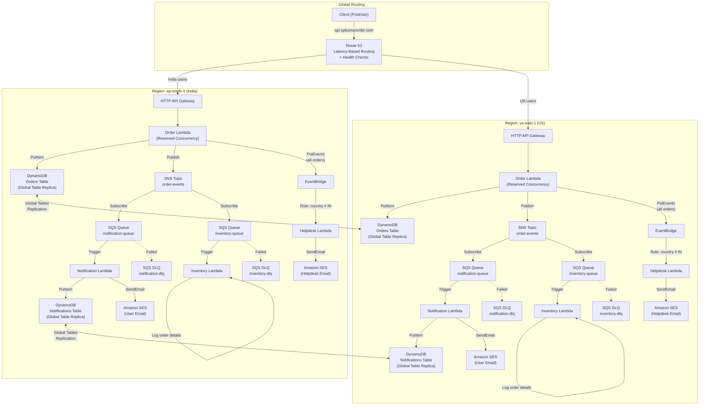
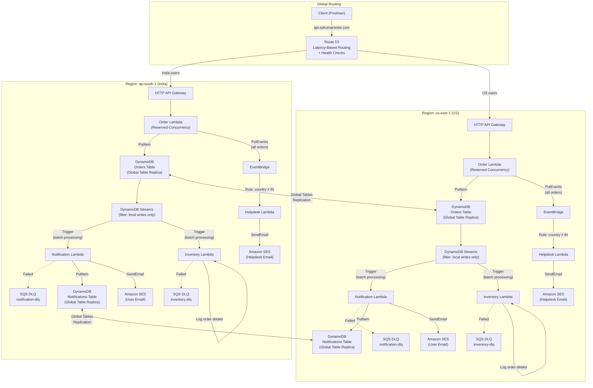
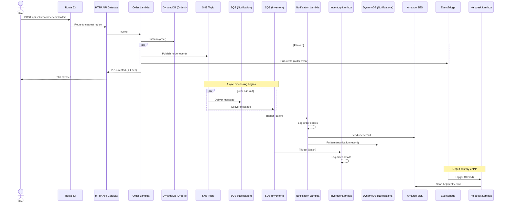
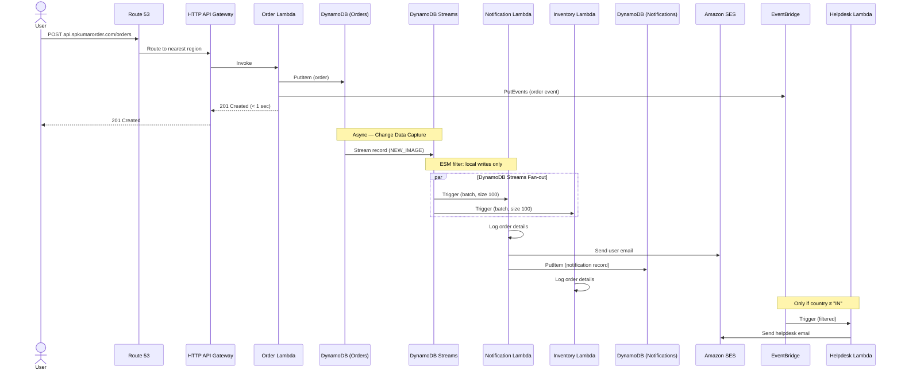
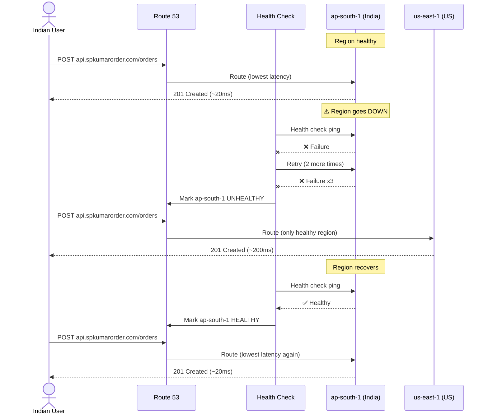
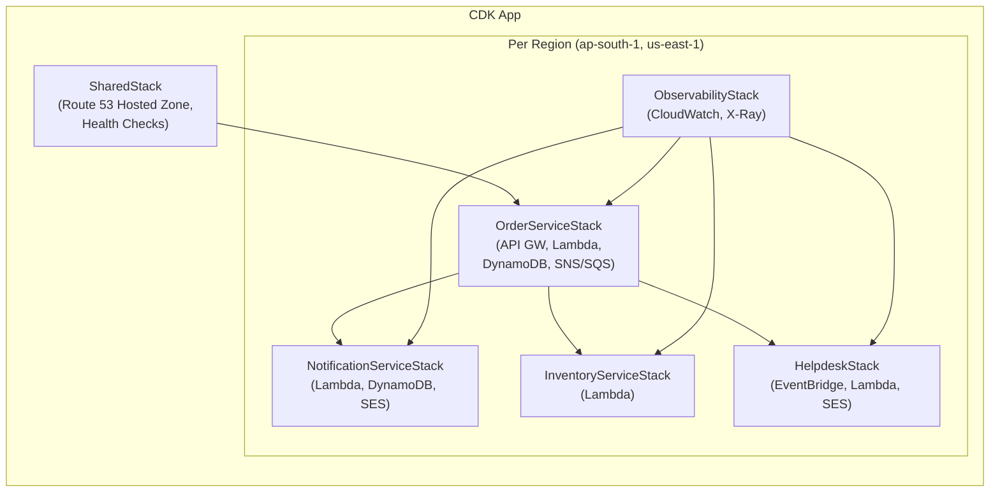

# Order Notification Distributed System — Architecture

## 1. Overview

A globally distributed, event-driven microservices system for processing orders at scale. The system spans two AWS regions (`ap-south-1` India, `us-east-1` US) with automatic failover via Route 53. The API is accessible at `api.spkumarorder.com`.

| Attribute | Detail |
|---|---|
| **Services** | Order, Notification, Inventory |
| **Regions** | `ap-south-1` (Mumbai), `us-east-1` (N. Virginia) |
| **Phase 1 Target** | 10,000 TPS |
| **Phase 2 Target** | 100,000 TPS |
| **Acknowledgment SLA** | < 1 second |
| **Tech Stack** | Node.js, TypeScript, AWS CDK, DynamoDB |

---

## 2. High-Level Design (HLD)

### 2.1 Phase 1 — 10K TPS (SNS + SQS)



### 2.2 Phase 2 — 100K TPS (DynamoDB Streams)



---

## 3. Service Descriptions

### 3.1 Order Service

| Attribute | Detail |
|---|---|
| **Responsibility** | Receive order payload, persist to DynamoDB, fan-out to downstream services |
| **Compute** | AWS Lambda (reserved concurrency) |
| **API** | HTTP API Gateway — `POST /orders` |
| **Database** | DynamoDB Global Table — `Orders` |
| **Outbound (Phase 1)** | SNS publish + EventBridge PutEvents |
| **Outbound (Phase 2)** | DynamoDB Streams (automatic) + EventBridge PutEvents |

### 3.2 Notification Service

| Attribute | Detail |
|---|---|
| **Responsibility** | Log order details, persist notification record, send user confirmation email |
| **Compute** | AWS Lambda (triggered by SQS in Phase 1, DynamoDB Streams in Phase 2) |
| **Database** | DynamoDB Global Table — `Notifications` |
| **Email** | Amazon SES (sandbox) — simple text email to user |

### 3.3 Inventory Service

| Attribute | Detail |
|---|---|
| **Responsibility** | Log/print order details |
| **Compute** | AWS Lambda (triggered by SQS in Phase 1, DynamoDB Streams in Phase 2) |
| **Database** | None (logging only) |

### 3.4 Helpdesk Service (EventBridge Consumer)

| Attribute | Detail |
|---|---|
| **Responsibility** | Send helpdesk email for non-India orders |
| **Compute** | AWS Lambda (triggered by EventBridge rule: `country ≠ "IN"`) |
| **Email** | Amazon SES (sandbox) — simple text email to fixed helpdesk address |

---

## 4. Data Flow

### 4.1 Order Placement (Phase 1 — SNS + SQS)



### 4.2 Order Placement (Phase 2 — DynamoDB Streams)



### 4.3 Failover Scenario



---

## 5. ER Diagrams (Per-Service Data Model)

### 5.1 Order Service — `Orders` Table

```mermaid
erDiagram
    ORDERS {
        string orderId PK "Partition Key (UUID v4)"
        string createdAt SK "Sort Key (ISO 8601)"
        string userId "User identifier"
        string userEmail "User email address"
        string country "Shipping destination country code (ISO 3166-1 alpha-2)"
        string status "Order status: PLACED | CONFIRMED | FAILED"
        string currency "ISO 4217 currency code (e.g. INR, USD)"
        number totalAmount "Order total amount"
        string items "Array of order items (JSON-serialized)"
        string region "AWS region where order was placed"
        string updatedAt "Last updated timestamp (ISO 8601)"
        number ttl "TTL epoch timestamp (optional)"
    }

    ORDER_ITEMS {
        string productId "Product identifier"
        string productName "Product name"
        number quantity "Quantity ordered"
        number unitPrice "Price per unit"
    }

    ORDERS ||--|{ ORDER_ITEMS : "contains"
```

**DynamoDB Table Design:**

| Attribute | Type | Key |
|---|---|---|
| `orderId` | String (UUID v4) | **Partition Key** |
| `createdAt` | String (ISO 8601) | **Sort Key** |
| `userId` | String | GSI-1 PK |
| `country` | String | GSI-2 PK |
| `status` | String | GSI-2 SK |

**Global Secondary Indexes:**

| GSI | Partition Key | Sort Key | Purpose |
|---|---|---|---|
| `GSI-userId-createdAt` | `userId` | `createdAt` | Query orders by user |
| `GSI-country-status` | `country` | `status` | Query orders by country/status |

---

### 5.2 Notification Service — `Notifications` Table

```mermaid
erDiagram
    NOTIFICATIONS {
        string notificationId PK "Partition Key (UUID v4)"
        string createdAt SK "Sort Key (ISO 8601)"
        string orderId "Reference to order"
        string userId "User identifier"
        string userEmail "Recipient email"
        string type "CONFIRMATION | HELPDESK"
        string status "SENT | FAILED | PENDING"
        string channel "EMAIL"
        string subject "Email subject line"
        string body "Email body content"
        string errorMessage "Error message if failed (optional)"
        number retryCount "Number of retry attempts"
        string sentAt "Timestamp email was sent (ISO 8601)"
        number ttl "TTL epoch timestamp (optional)"
    }
```

**DynamoDB Table Design:**

| Attribute | Type | Key |
|---|---|---|
| `notificationId` | String (UUID v4) | **Partition Key** |
| `createdAt` | String (ISO 8601) | **Sort Key** |
| `orderId` | String | GSI-1 PK |
| `status` | String | GSI-2 PK |
| `type` | String | GSI-2 SK |

**Global Secondary Indexes:**

| GSI | Partition Key | Sort Key | Purpose |
|---|---|---|---|
| `GSI-orderId` | `orderId` | `createdAt` | Query notifications by order |
| `GSI-status-type` | `status` | `type` | Query failed notifications for retry |

---

### 5.3 Inventory Service — No Table

The Inventory Service only logs/prints order details. No DynamoDB table is needed.

> [!NOTE]
> Although the requirement states "database per service," the Inventory Service only logs data in this POC. A DynamoDB table can be added in a future phase if inventory tracking is needed.

---

## 6. Cross-Service Event Schemas

### 6.1 SNS/SQS Order Event (Phase 1)

```json
{
  "eventId": "evt-uuid-v4",
  "eventType": "ORDER_PLACED",
  "timestamp": "2026-02-26T12:00:00.000Z",
  "source": "order-service",
  "region": "ap-south-1",
  "data": {
    "orderId": "ord-uuid-v4",
    "userId": "user-123",
    "userEmail": "user@example.com",
    "country": "IN",
    "currency": "INR",
    "totalAmount": 2999.00,
    "status": "PLACED",
    "items": [
      {
        "productId": "prod-001",
        "productName": "Wireless Mouse",
        "quantity": 1,
        "unitPrice": 2999.00
      }
    ]
  }
}
```

### 6.2 EventBridge Event (Helpdesk Rule)

```json
{
  "source": "order-service",
  "detail-type": "OrderPlaced",
  "detail": {
    "orderId": "ord-uuid-v4",
    "userId": "user-456",
    "userEmail": "user@example.com",
    "country": "US",
    "totalAmount": 49.99,
    "currency": "USD"
  }
}
```

**EventBridge Rule (matches non-India orders):**

```json
{
  "source": ["order-service"],
  "detail-type": ["OrderPlaced"],
  "detail": {
    "country": [{ "anything-but": "IN" }]
  }
}
```

### 6.3 DynamoDB Streams Record (Phase 2)

The consumer Lambda receives `DynamoDBStreamEvent` with `NEW_IMAGE` containing the full order item. Replicated writes from other regions must be filtered out to avoid duplicate processing.

**Recommended: Lambda Event Source Mapping (ESM) Filter** (preferred — avoids unnecessary Lambda invocations and reduces cost):

```json
{
  "Filters": [
    {
      "Pattern": "{\"dynamodb\":{\"NewImage\":{\"aws:rep:updateregion\":{\"S\":[{\"exists\":false}]}}}}"
    }
  ]
}
```

**Alternative: Application-Level Filter** (fallback if ESM filters are insufficient):

```typescript
// Filter: process only local writes, skip replicated ones
const isReplicatedWrite = record.dynamodb?.NewImage?.['aws:rep:updateregion'];
if (isReplicatedWrite) return; // Skip — this was replicated from another region
```

> [!TIP]
> ESM filters are evaluated before Lambda invocation, so filtered events don't incur Lambda execution costs. This is the preferred approach for Phase 2 at 100K TPS.

---

## 7. Infrastructure Architecture

### 7.1 CDK Stack Structure



### 7.2 AWS Services Used

| Service | Purpose | Phase |
|---|---|---|
| **Route 53** | Latency-based routing + health check failover | 1 & 2 |
| **HTTP API Gateway** | REST endpoint for `POST /orders` | 1 & 2 |
| **AWS Lambda** | Compute for all services | 1 & 2 |
| **DynamoDB Global Tables** | Multi-region data storage (On-Demand) | 1 & 2 |
| **Amazon SNS** | Fan-out order events to SQS queues | 1 |
| **Amazon SQS** | Queue for async processing (Phase 1) + DLQ (Phase 1 & 2) | 1 & 2 |
| **DynamoDB Streams** | Change data capture for event-driven processing | 2 |
| **Amazon EventBridge** | Content-based routing for helpdesk emails | 1 & 2 |
| **Amazon SES** | Email delivery (sandbox) | 1 & 2 |
| **CloudWatch** | Dashboards, metrics, alarms, logs | 1 & 2 |
| **AWS X-Ray** | Distributed tracing | 1 & 2 |

---

## 8. Scalability & Capacity Planning

### 8.1 Phase 1 — 10K TPS

| Component | Configuration | Justification |
|---|---|---|
| **API Gateway** | HTTP API, default 10K RPS limit | Matches Phase 1 target |
| **Order Lambda** | Reserved concurrency: ~2,000 per region | 10K TPS × ~200ms avg duration = ~2K concurrent |
| **Notification Lambda** | Reserved concurrency: ~500 per region | Batched via SQS (batch size 10) = ~1K invocations/sec |
| **Inventory Lambda** | Reserved concurrency: ~500 per region | Batched via SQS (batch size 10) = ~1K invocations/sec |
| **Helpdesk Lambda** | Reserved concurrency: ~100 per region | Low volume (non-India only) |
| **DynamoDB** | On-Demand (auto-scales) | Handles 10K WPS without provisioning |
| **SNS** | Default 30K msg/sec | Sufficient for 10K TPS |
| **SQS** | Standard queue (unlimited throughput) | Handles any volume |

### 8.2 Phase 2 — 100K TPS

| Component | Configuration | Justification |
|---|---|---|
| **API Gateway** | HTTP API, request limit increase to 100K RPS | AWS support ticket required |
| **Order Lambda** | Reserved concurrency: ~20,000 per region | 100K TPS × ~200ms = ~20K concurrent |
| **Notification Lambda** | Reserved concurrency: ~2,000 per region | Batched via DDB Streams (batch size 100) |
| **Inventory Lambda** | Reserved concurrency: ~2,000 per region | Batched via DDB Streams (batch size 100) |
| **DynamoDB** | On-Demand (auto-scales, request table limit increase) | Default On-Demand limit: 40K WCU |
| **DynamoDB Streams** | Auto-scales with table | No manual config needed |

> [!IMPORTANT]
> Phase 2 requires AWS service limit increases for: API Gateway (100K RPS), Lambda concurrency (20K+), and DynamoDB On-Demand throughput (100K+ WCU). Submit requests via AWS Support before Phase 2 deployment.

---

## 9. Resilience & Fault Tolerance

| Strategy | Implementation |
|---|---|
| **Multi-region active-active** | Full stack deployed in `ap-south-1` + `us-east-1` |
| **Automatic failover** | Route 53 health checks detect regional failure in ~30 sec |
| **Data replication** | DynamoDB Global Tables with ~1 sec replication lag |
| **Dead Letter Queues** | SQS DLQs capture failed Lambda invocations for retry |
| **Exactly-once (Phase 2)** | Filter replicated DynamoDB Stream writes via `aws:rep:updateregion` |
| **Idempotent writes** | Unique `orderId` (UUID) prevents duplicate orders |
| **SES retry** | Notification Lambda retries failed emails with exponential backoff |

---

## 10. Observability

### 10.1 CloudWatch Dashboards

| Dashboard | Metrics |
|---|---|
| **Order Service** | API GW latency (p50/p99), Lambda errors/duration, DynamoDB WCU/throttles |
| **Notification Service** | SQS queue depth, Lambda errors, SES send/bounce/complaint rates |
| **Inventory Service** | SQS queue depth, Lambda errors |
| **System Health** | Cross-region comparison, DLQ message count, Route 53 health check status |

### 10.2 X-Ray Tracing

All Lambda functions have active X-Ray tracing enabled. Service map visualizes:
- API Gateway → Order Lambda → DynamoDB
- SQS/Streams → Notification Lambda → SES
- SQS/Streams → Inventory Lambda
- EventBridge → Helpdesk Lambda → SES

---

## 11. Cost Estimation (Phase 1 — 10K TPS, per region)

| Service | Monthly Estimate |
|---|---|
| **API Gateway** (HTTP API) | ~$3,500 (10K TPS × $1.00/million requests) |
| **Lambda** (Order, ~2K concurrency) | ~$5,400 (invocations + 200ms × 256MB) |
| **Lambda** (Notification + Inventory) | ~$2,700 |
| **DynamoDB On-Demand** (10K WPS) | ~$3,300 (write) + ~$650 (read) |
| **SNS** | ~$13,000 (~25.9B messages/month × $0.50/million) |
| **SQS** (2 queues) | ~$20,700 (~51.8B requests × $0.40/million) |
| **EventBridge** | ~$26 |
| **SES** (sandbox) | ~$0.10/1000 emails |
| **Route 53** | ~$1 (hosted zone) + health checks |
| **CloudWatch + X-Ray** | ~$200 |
| **Total (per region)** | **~$45,000 - $50,000/month** |

> [!NOTE]
> These are rough estimates for sustained 10K TPS (24/7). Actual POC costs will be significantly lower since testing won't sustain max throughput continuously. Use AWS Pricing Calculator for precise figures.

---

## 12. Phase Comparison

| Feature | Phase 1 | Phase 2 |
|---|---|---|
| **Target TPS** | 10,000 | 100,000 |
| **Messaging** | SNS + SQS (fan-out) | DynamoDB Streams |
| **Routing** | Route 53 | Route 53 |
| **Regions** | Multi-region (active-active) | Multi-region (active-active) |
| **Deduplication** | Not needed (SNS is regional) | Filter via `aws:rep:updateregion` |
| **Helpdesk emails** | EventBridge | EventBridge |
| **DynamoDB** | Global Tables (On-Demand) | Global Tables (On-Demand) |
| **DLQ** | SQS DLQ | SQS DLQ |
| **Observability** | CloudWatch + X-Ray | CloudWatch + X-Ray |
| **Migration strategy** | — | Feature flag (`MESSAGING_MODE`) |

### 12.1 Phase Migration via Feature Flag

The Order Lambda reads a `MESSAGING_MODE` environment variable (set via CDK/SSM Parameter Store) to switch messaging backends without redeployment:

```typescript
const messagingMode = process.env.MESSAGING_MODE ?? 'SNS'; // 'SNS' | 'STREAMS'

if (messagingMode === 'SNS') {
  // Phase 1: publish to SNS (fans out to SQS → Notification & Inventory Lambdas)
  await sns.publish({ TopicArn: ORDER_EVENTS_TOPIC_ARN, Message: JSON.stringify(event) }).promise();
} else {
  // Phase 2: skip SNS publish — DynamoDB Streams drives downstream processing automatically
  // (Notification & Inventory Lambdas are triggered directly by the stream)
}

// EventBridge PutEvents always fires in both phases (helpdesk emails)
await eventbridge.putEvents({ Entries: [helpdeskEvent] }).promise();
```

**Migration procedure:**
1. Deploy Phase 2 infrastructure (DynamoDB Streams ESM triggers on Notification & Inventory Lambdas) alongside Phase 1 infrastructure — both exist simultaneously.
2. Set `MESSAGING_MODE=SNS` (default) — Phase 1 path is active; Phase 2 Lambdas are idle.
3. Flip `MESSAGING_MODE=STREAMS` per region (start with `us-east-1`, validate, then `ap-south-1`).
4. Monitor CloudWatch for duplicate or missing notifications during the rollout window.
5. Once stable, decommission SNS topics and SQS queues.

> [!TIP]
> Because the flag is an environment variable, rollback is instant — flip `MESSAGING_MODE` back to `SNS` if issues are detected, with no code change or redeployment required.
